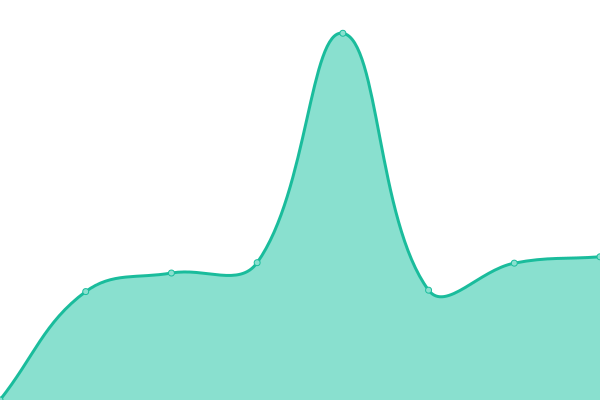

# [📈 Live Status](https://eanbear.github.io/upptime): <!--live status--> **🟧 部分停机**

This repository contains the open-source uptime monitor and status page for [eanbear](https://eanbear.github.io/upptime), powered by [Upptime](https://github.com/upptime/upptime).

With [Upptime](https://upptime.js.org), you can get your own unlimited and free uptime monitor and status page, powered entirely by a GitHub repository. We use [Issues](https://github.com/eanbear/upptime/issues) as incident reports, [Actions](https://github.com/eanbear/upptime/actions) as uptime monitors, and [Pages](https://eanbear.github.io/upptime) for the status page.

<!--start: status pages-->
<!-- This summary is generated by Upptime (https://github.com/upptime/upptime) -->
<!-- Do not edit this manually, your changes will be overwritten -->
<!-- prettier-ignore -->
| 链接 | 状态 | 历史 | 响应时间 | 正常运行时间 |
| --- | ------ | ------- | ------------- | ------ |
|  [Baidu](https://www.baidu.com) | 🟩 正常运行 | [baidu.yml](https://github.com/eanbear/upptime/commits/HEAD/history/baidu.yml) | 

 2194毫秒
     
 | 

<a href="https://eanbear.github.io/upptime/history/baidu">100.00%</a>
    

|  Pwk_cn | 🟩 正常运行 | [pwk-cn.yml](https://github.com/eanbear/upptime/commits/HEAD/history/pwk-cn.yml) | 

 1959毫秒
     
 | 

<a href="https://eanbear.github.io/upptime/history/pwk-cn">99.57%</a>
    

|  Pwk_en | 🟩 正常运行 | [pwk-en.yml](https://github.com/eanbear/upptime/commits/HEAD/history/pwk-en.yml) | 

 1461毫秒
     
 | 

<a href="https://eanbear.github.io/upptime/history/pwk-en">100.00%</a>
    

|  DeckM_cn | 🟩 正常运行 | [deck-m-cn.yml](https://github.com/eanbear/upptime/commits/HEAD/history/deck-m-cn.yml) | 

 2052毫秒
     
 | 

<a href="https://eanbear.github.io/upptime/history/deck-m-cn">100.00%</a>
    

|  DeckM_en | 🟥 停机 | [deck-m-en.yml](https://github.com/eanbear/upptime/commits/HEAD/history/deck-m-en.yml) | 

 1907毫秒
     
 | 

<a href="https://eanbear.github.io/upptime/history/deck-m-en">98.05%</a>
    

|  fstdec | 🟩 正常运行 | [fstdec.yml](https://github.com/eanbear/upptime/commits/HEAD/history/fstdec.yml) | 

 870毫秒
     
 | 

<a href="https://eanbear.github.io/upptime/history/fstdec">100.00%</a>
    

<!--end: status pages-->

[**Visit our status website →**](https://eanbear.github.io/upptime)

## 📄 License

- Powered by: [Upptime](https://github.com/upptime/upptime)
- Code: [MIT](./LICENSE) © [eanbear](https://eanbear.github.io/upptime)
- Data in the `./history` directory: [Open Database License](https://opendatacommons.org/licenses/odbl/1-0/)
